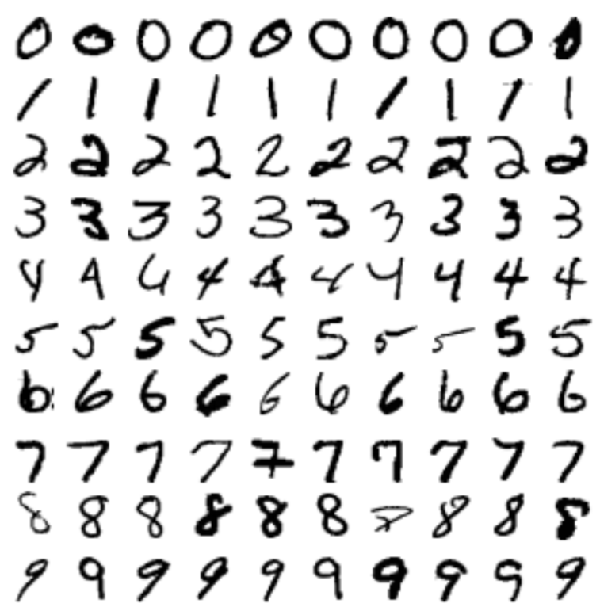
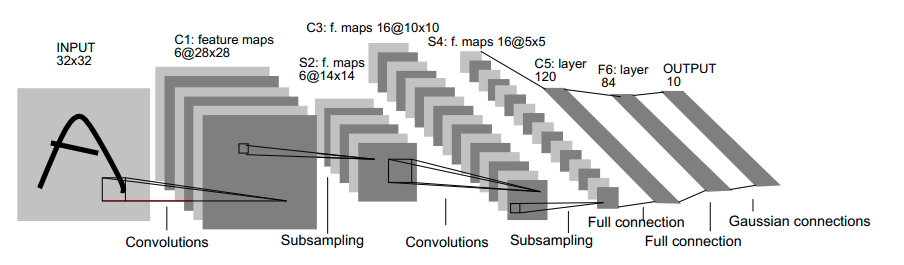
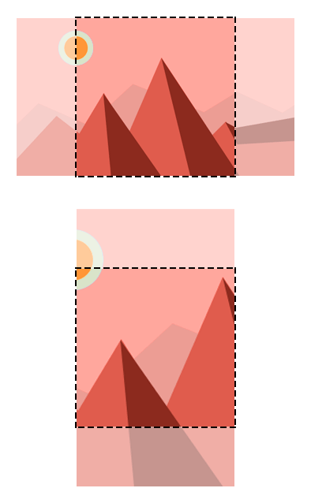

mxnet
========================================================
author: Tong He 
date: July 11th, 2018
autosize: true

Outline
========================================================

- Introduction
- Configuration
- ndarray: data type
- Train your Network
- Fine-tune

Introduction
========================================================

`mxnet` is a package for

- Deep Learning
- GPU accelerating computation

Configuration
========================================================

Prerequisite:
  - OpenBLAS
  - OpenCV
  - If with GPU
    - CUDA
    - CuDNN

Configuration
========================================================

CPU-only:

- Linux
  - Follow our [official guide](https://mxnet.incubator.apache.org/install/index.html?platform=Linux&language=R&processor=CPU) on CPU building
- OSX and Windows

```
cran <- getOption("repos")
cran["dmlc"] <- "https://apache-mxnet.s3-accelerate.dualstack.amazonaws.com/R/CRAN/"
options(repos = cran)
install.packages("mxnet")
```

Configuration
========================================================

*I don't want to waste my 1080Ti!*

- Linux
  - Follow our [official guide](https://mxnet.incubator.apache.org/install/index.html?platform=Linux&language=R&processor=GPU) on GPU building
- Windows
  - Take [this document](https://github.com/jeremiedb/mxnet_winbin) as a reference.
  
Configuration
========================================================

Test your installation


```r
library(mxnet)
a <- mx.nd.ones(c(2, 3))
b <- a * 2 + 1
b
```

```
     [,1] [,2] [,3]
[1,]    3    3    3
[2,]    3    3    3
```

If has GPU


```r
a <- mx.nd.ones(c(3, 2), ctx=mx.gpu())
b <- a * 2 + 1
b
```

```
     [,1] [,2]
[1,]    3    3
[2,]    3    3
[3,]    3    3
```

NDArray
========================================================

Create an NDArray:


```r
a <- mx.nd.array(1:5)
a
```

```
[1] 1 2 3 4 5
```

```r
class(a)
```

```
[1] "MXNDArray"
```

NDArray
========================================================

Vectorization:


```r
b <- a + 1/a
b
```

```
[1] 2.000000 2.500000 3.333333 4.250000 5.200000
```

```r
class(b)
```

```
[1] "MXNDArray"
```

NDArray
========================================================

Math


```r
mx.nd.log(a+10)
```

```
[1] 2.397895 2.484907 2.564949 2.639057 2.708050
```

Random sampling


```r
mx.nd.random.normal(0, 1, 10)
```

```
 [1]  2.2122064  0.7740038  1.0434405  1.1839255  1.8917114 -1.2347414
 [7] -1.7710290 -0.4513845  0.5793836 -1.8560820
```

NDArray
========================================================

Convert to R vector/matrix/array


```r
a <- mx.nd.ones(c(2, 3))
mat_a <- as.matrix(a)
mat_a
```

```
     [,1] [,2] [,3]
[1,]    1    1    1
[2,]    1    1    1
```

```r
class(a)
```

```
[1] "MXNDArray"
```

NDArray
========================================================

- GPU compatible computation


```r
a <- mx.nd.ones(c(2,3), ctx=mx.gpu())
b <- a * 2 + 1
b
```

```
     [,1] [,2] [,3]
[1,]    3    3    3
[2,]    3    3    3
```

```r
class(b)
```

```
[1] "MXNDArray"
```

NDArray
========================================================

Why ANOTHER data type?

- GPU compatible computation

NDArray
========================================================

- Matrix multiplication on CPU


```r
mat <- matrix(runif(4000*4000), 4000, 4000)
system.time({
  res_mat <- mat %*% mat
})
```

NDArray
========================================================

- Matrix multiplication on GPU


```r
system.time({
  a <- mx.nd.array(mat, ctx = mx.gpu())
  res <- mx.nd.dot(a, a)
  res_mat <- as.matrix(res)
})
class(res)
class(res_mat)
```

NDArray
========================================================

- Asynchronous computation


```r
a <- mx.nd.array(mat)
system.time({
  res <- mx.nd.dot(a, a)
})
system.time({
  res_mat <- as.matrix(res)
})
```

Neural Network
========================================================


Neural Network
========================================================

Basic building blocks (Layers):

- Fully Connected
- Convolutional
- Pooling
- Activation

Neural Network
========================================================

Fully Connected


$$f(x) = Wx+b$$

Definition:


```r
fc = mx.symbol.FullyConnected()
```

Neural Network
========================================================

Convolutional


Definition:


```r
conv = mx.symbol.Convolution()
```

Neural Network
========================================================

Pooling


Definition:


```r
pool1 <- mx.symbol.Pooling(pool.type='avg')
```

Neural Network
========================================================

Activation


Definition:


```r
act1 <- mx.symbol.Activation(pool.type='relu')
```

MNIST
========================================================

[MNIST](http://yann.lecun.com/exdb/mnist/) is a dataset of handwritten digits.

The "Hello World" dataset in deep learning.

- 60k training samples and 10k testing samples
- 28x28 in grayscale



MNIST
========================================================

Download with:


```r
download.file('https://apache-mxnet.s3-accelerate.dualstack.amazonaws.com/')
```

Load in with:

```r
load('mnist.rda')
dim(train_mnist)
```

```
[1] 60000   785
```

```r
dim(test_mnist)
```

```
[1] 10000   785
```

MNIST
========================================================

Let's take a look!


```r
plot_mnist <- function(dat, ind) {
      mat <- matrix(as.numeric(dat[ind,-1]), 28, 28)
      image(mat[,28:1], axes=FALSE, col=grey(seq(0, 1, length = 256)))
}
plot_mnist(train_mnist, 19)
```


MNIST
========================================================

Prepare data


```r
x <- train_mnist[,-1]
y <- train_mnist[,1]

x.test <- test_mnist[,-1]
y.test <- test_mnist[,1]
```

Define input iterator


```r
train_mnist_iter <- mx.io.arrayiter(t(x), y, batch.size = 128, shuffle = TRUE)
test_mnist_iter <- mx.io.arrayiter(t(x.test), y.test, batch.size = 128, shuffle = FALSE)
```

Neural Network
========================================================

Let's build a MLP with 256 hidden layers.


```r
small_net = function() {
  data <- mx.symbol.Variable("data")
  
  fc1 <- mx.symbol.FullyConnected(data, num_hidden = 256)
  act <- mx.symbol.Activation(fc1, act_type = 'tanh')
  
  fc2 <- mx.symbol.FullyConnected(act, num_hidden = 10)
  net <- mx.symbol.SoftmaxOutput(data=fc2)
  return(net)
}

net = small_net()
```

It's a `784 -> 256 -> 10` MLP model.

Neural Network
========================================================

Train with our net:


```r
model <- mx.model.FeedForward.create(net, train_mnist_iter, ctx=mx.cpu(),
                                     eval.metric=mx.metric.accuracy,
                                     eval.data=test_mnist_iter,
                                     learning.rate=0.01, num.round=10)
```

Neural Network
========================================================

There's `mx.mlp` for fast model definition and training with mlp.


```r
model <- mx.mlp(train_mnist_iter, hidden_node=c(256), out_node=10, ctx=mx.cpu(), 
                eval.metric=mx.metric.accuracy,
                eval.data=test_mnist_iter,
                learning.rate=0.01, num.round=10)
```

Neural Network
========================================================

How about we add more hidden layers?


```r
model <- mx.mlp(train_mnist_iter, hidden_node=c(256, 100, 50), out_node=10, ctx=mx.cpu(), 
                eval.metric=mx.metric.accuracy,
                eval.data=test_mnist_iter,
                learning.rate=0.1, num.round=10)
```


FashionMNIST
========================================================

[FashionMNIST](https://github.com/zalandoresearch/fashion-mnist) is a dataset to replace MNIST

- 60k training samples and 10,000 testing samples
- 28x28 in grayscale


FashionMNIST
========================================================

Download with:


```r
download.file('https://apache-mxnet.s3-accelerate.dualstack.amazonaws.com/')
```

Load in with:

```r
load('fmnist.rda')
dim(train_fmnist)
```

```
[1] 60000   785
```

```r
dim(test_fmnist)
```

```
[1] 10000   785
```

FashionMNIST
========================================================

Let's take a look!


```r
plot_mnist(train_fmnist, 1)
```


FashionMNIST
========================================================

Data preparation


```r
x <- train_fmnist[,-1]
y <- train_fmnist[,1]

x.test <- test_fmnist[,-1]
y.test <- test_fmnist[,1]

train_fmnist_iter <- mx.io.arrayiter(t(x), y, batch.size = 128, shuffle = TRUE)
test_fmnist_iter <- mx.io.arrayiter(t(x.test), y.test, batch.size = 128, shuffle = FALSE)
```

Neural Network
========================================================

First we train with the same MLP


```r
model <- mx.mlp(train_fmnist_iter, hidden_node=c(256), out_node=10, ctx=mx.cpu(), 
                eval.metric=mx.metric.accuracy,
                eval.data=test_fmnist_iter,
                learning.rate=0.01, num.round=10)
```

Neural Network
========================================================

Next, we try to train with a LeNet:



We use two new building blocks: convolutional and pooling layers.

Neural Network
========================================================

LeNet in `mxnet`


```r
get.lenet <- function() {
  # input
  data <- mx.symbol.Variable('data')
  # first conv
  conv1 <- mx.symbol.Convolution(data=data, kernel=c(5,5), num_filter=6)
  relu1 <- mx.symbol.Activation(data=conv1, act_type="relu")
  pool1 <- mx.symbol.Pooling(data=relu1, pool_type="max",
                             kernel=c(2,2), stride=c(2,2))
  # second conv
  conv2 <- mx.symbol.Convolution(data=pool1, kernel=c(3,3), num_filter=16)
  relu2 <- mx.symbol.Activation(data=conv2, act_type="relu")
  pool2 <- mx.symbol.Pooling(data=relu2, pool_type="max",
                             kernel=c(2,2), stride=c(2,2))
  # first fullc
  flatten <- mx.symbol.Flatten(data=pool2)
  fc1 <- mx.symbol.FullyConnected(data=flatten, num_hidden=120)
  relu3 <- mx.symbol.Activation(data=fc1, act_type="relu")
  # second fullc
  fc2 <- mx.symbol.FullyConnected(data=relu3, num_hidden=84)
  relu4 <- mx.symbol.Activation(data=fc2, act_type="relu")
  # final fullc
  fc3 <- mx.symbol.FullyConnected(data=relu4, num_hidden=10)
  # loss
  lenet <- mx.symbol.SoftmaxOutput(data=fc3)
  return(lenet)
}

lenet = get.lenet()
```

Neural Network
========================================================

Before we train model, we need to re-prepare our data:

1. Map pixel values from [0, 255] into [0, 1]
2. Reshape data into 28x28x1


```r
x <- train_fmnist[,-1]
y <- train_fmnist[,1]

x.test <- test_fmnist[,-1]
y.test <- test_fmnist[,1]

# transpose and reshape
x <- t(x/255)
dim(x) <- c(28, 28, 1, ncol(x))
x.test <- t(x.test/255)
dim(x.test) <- c(28, 28, 1, ncol(x.test))

train_fmnist_iter <- mx.io.arrayiter(x, y, batch.size = 128, shuffle = TRUE)
test_fmnist_iter <- mx.io.arrayiter(x.test, y.test, batch.size = 128, shuffle = FALSE)
```

Neural Network
========================================================

Dive deep into LeNet


```r
model = mx.model.FeedForward.create(lenet, train_fmnist_iter, ctx=mx.cpu(),
                                    eval.metric=mx.metric.accuracy,
                                    eval.data=test_fmnist_iter,
                                    initializer = mx.init.Xavier(),
                                    learning.rate=0.1, num.round=1)
```

Neural Network
========================================================

Training time on GPU:


```r
model = mx.model.FeedForward.create(lenet, train_fmnist_iter, ctx=mx.gpu(),
                                    eval.metric=mx.metric.accuracy,
                                    eval.data=test_fmnist_iter,
                                    initializer = mx.init.Xavier(),
                                    learning.rate=0.1, num.round=10)
```


Neural Network
========================================================

How about we tune some parameters?


```r
model = mx.model.FeedForward.create(lenet, train_fmnist_iter, ctx=mx.gpu(),
                                    eval.metric=mx.metric.accuracy,
                                    eval.data=test_fmnist_iter,
                                    initializer = mx.init.Xavier(),
                                    learning.rate=0.01, num.round=10)
```

Neural Network
========================================================

Why do we say MNIST is too simple?


```r
x <- train_mnist[,-1]
y <- train_mnist[,1]

x.test <- test_mnist[,-1]
y.test <- test_mnist[,1]

# transpose and reshape
x <- t(x/255)
dim(x) <- c(28, 28, 1, ncol(x))
x.test <- t(x.test/255)
dim(x.test) <- c(28, 28, 1, ncol(x.test))

train_mnist_iter <- mx.io.arrayiter(x, y, batch.size = 128, shuffle = TRUE)
test_mnist_iter <- mx.io.arrayiter(x.test, y.test, batch.size = 128, shuffle = FALSE)
```

Neural Network
========================================================

Why do we say MNIST is too simple?


```r
model = mx.model.FeedForward.create(lenet, train_mnist_iter, ctx=mx.gpu(),
                                    eval.metric=mx.metric.accuracy,
                                    eval.data=test_mnist_iter,
                                    initializer = mx.init.Xavier(),
                                    learning.rate=0.1, num.round=10)
```

Neural Network
========================================================

Lessons learned

- GPU is indeed helpful
- Convolution is helpful
- Parameter tuning is helpful

Pre-trained Model
========================================================

What is a pre-trained model?

- Model trained on a large dataset
  - ImageNet
- Can be used to
  - classify images
  - fine-tuned for another task

Pre-trained Model
========================================================

Where do I get one?

Let's use ResNet18.


```r
base_model_url <- 'http://data.mxnet.io/models/'
symbol_url <- paste0(base_model_url, 'imagenet/resnet/18-layers/resnet-18-symbol.json')
params_url <- paste0(base_model_url, 'imagenet/resnet/18-layers/resnet-18-0000.params')
synset_url <- paste0(base_model_url, 'imagenet/resnet/synset.txt')
download.file(symbol_url, 'model/resnet-18-symbol.json')
download.file(params_url, 'model/resnet-18-0000.params')
download.file(synset_url, 'model/synset.txt')
```

Pre-trained Model
========================================================

How do I load them?


```r
model <- mx.model.load('model/resnet-18', 0)
```

Pre-trained Model
========================================================

Image Preprocessing

- CenterCrop 
- Normalize



Pre-trained Model
========================================================

Image Preprocessing


```r
library(imager)
resize.image <- function(im, size) {
  shape <- dim(im)
  short.edge <- min(shape[1:2])
  offset.x <- floor((shape[1] - short.edge) / 2)
  offset.y <- floor((shape[2] - short.edge) / 2)
  
  # crop
  cropped <- crop.borders(im, offset.x, offset.y)
  # resize to size x size, needed by input of the model.
  resized <- resize(cropped, size, size)
  return(resized)
}
```

Pre-trained Model
========================================================

Image Preprocessing


```r
normalize.image <-function(im, mean_vec, std_vec) {
  arr <- as.array(im)
  dim(arr) <- dim(arr)[-3]
  arr = arr * 255
  # substract the mean
  for (i in 1:length(mean_vec)) {
    arr[,,i] = (arr[,,i]-mean_vec[i])/std_vec[i]
  }
  # Reshape to format needed by mxnet (width, height, channel, num)
  dim(arr) <- c(dim(arr), 1)
  return(arr)
}
```

Pre-trained Model
========================================================

Load the image


```r
im <- load.image('img/mtbaker.jpg')
plot(im)
```


Pre-trained Model
========================================================

Cropped image


```r
im_resized = resize.image(im, 224)
plot(im_resized)
```


Pre-trained Model
========================================================

Normalize image


```r
im_normed = normalize.image(im_resized, c(123.68, 116.779, 103.939), c(1, 1, 1))
```

Pre-trained Model
========================================================

Let's test!


```r
prob <- predict(model, X=im_normed)
dim(prob)
```

```
[1] 1000    1
```

The top-5 classes


```r
max.idx <- order(prob[,1], decreasing = TRUE)[1:5]
max.idx
```

```
[1] 981 971 673 980 976
```

Pre-trained Model
========================================================

Load in the name of classes


```r
synset <- readLines('model/synset.txt')
print(paste0("Predicted Top-classes: ", synset[max.idx]))
```

```
[1] "Predicted Top-classes: n09472597 volcano"            
[2] "Predicted Top-classes: n09193705 alp"                
[3] "Predicted Top-classes: n03792972 mountain tent"      
[4] "Predicted Top-classes: n09468604 valley, vale"       
[5] "Predicted Top-classes: n09332890 lakeside, lakeshore"
```

Pre-trained Model
========================================================

Try it now!

What Else?
========================================================

What else can we do with deep learning?

- Object Detection
- Semantic Segmentation
- Language Modeling
- Machine Translation
- Recommender System
- Facial Recognition
- ...

About
========================================================

Examples: https://github.com/apache/incubator-mxnet/tree/master/example

Forum: https://discuss.mxnet.io/

Q&A
========================================================
