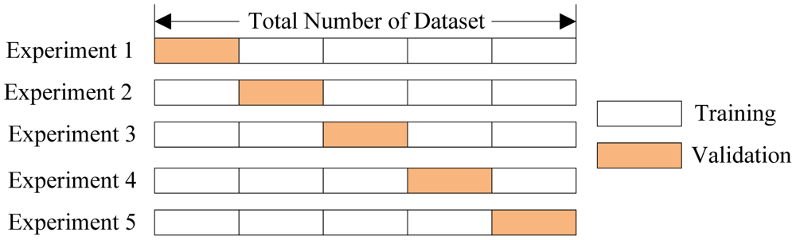

XGBoost
========================================================
author: Tong He 
date: July 11th, 2018
autosize: true

Outline
========================================================

- Introduction
- A tree-based model
- Training
- Interpretation
- Parameter-Tuning

Introduction
========================================================

Simply 


```r
install.packages('xgboost')
```

Load in


```r
library('xgboost')
```

eXtreme Gradient Boosting
========================================================

Base Model + Boosting

Tree-based Model
========================================================


Tree-based Model
========================================================

[Explanation in Animation](http://www.r2d3.us/visual-intro-to-machine-learning-part-1/)

Why Tree-based Model
========================================================

Advantages

- Interpretable
- Efficient
- Accurate
- No need to normalize

Boosting
========================================================

What to do with a weak model?

- Make it stronger!
- **Ask for help from the others**

Boosting
========================================================

Go beyond a single tree


Boosting
========================================================

- Add simultaneously
  - random forest
- Add **in sequential**

Boosting
========================================================
incremental: true

Iterative algorithm

- Iter 1
  - predict $y$ with $f_1(x)$
  - calculate $r_1 = y - f_1(x)$
- Iter 2
  - predict $r_1$ with $f_2(x)$
  - calculate $r_2 = r_1 - f_2(x)$
- ...


Every new $f_i(x)$ improves from $f_{i-1}(x)$

Boosting
========================================================

One step further

- replace $r_1$ with $L(y, f_1(x))$
- ...
- replace $r_T$ with $L(y, \sum_t^T f_t(x))$

$$
\begin{align}
L[y, \sum_t^T f_t(x)] & = L[y, \sum_t^{T-1} f_t(x) + f_T(x)] \\
& \approx L[y, \sum_t^{T-1} f_t(x)] + g(x)f_T(x)
\end{align}
$$

Boosting
========================================================

Model

$$ pred = \sum_{t=1}^{T} f_t(x) $$

Objective

$$ Obj =  L[\sum_{t=1}^{T} f_t(x), y] $$


Why XGBoost
========================================================

- Regularization

$$ Obj = \sum_{t=1}^{T} L(f_t(x), y) + \Omega(f_t)$$

- Using both first and second order gradient

$$L(f_t(x), y) \approx g(x)f_t(x) + h(x)f^2_t(x)$$

- Prune on a full binary tree

Training
========================================================

[Human Resource Analytics](https://github.com/ryankarlos/Human-Resource-Analytics-Kaggle-Dataset)

- Moderate size
- Meaningful features
- Binary classification


```r
load('data/hr.rda')
dim(train_hr)
```

```
[1] 14999    10
```

Training
========================================================

Prepare data

- No need to normalize


```r
ind <- sample(nrow(train_hr))
train_ind <- ind[1:10000]
test_ind <- ind[10001:14999]

x <- train_hr[train_ind, -1]
# zero-based class label
y <- train_hr[train_ind, 1]

x.test <- train_hr[test_ind, -1]
y.test <- train_hr[test_ind, 1]
```

Training
========================================================

Cross Validation



Training
========================================================

Cross Validation


```r
param <- list("objective" = "binary:logistic",
              "eval_metric" = "auc")

bst.cv <- xgb.cv(param = param, data = x, label = y, 
                 nfold = 3, nrounds = 10)
```

```
[1]	train-auc:0.976770+0.002266	test-auc:0.973146+0.005496 
[2]	train-auc:0.980403+0.001100	test-auc:0.977338+0.005238 
[3]	train-auc:0.984626+0.000995	test-auc:0.981401+0.004794 
[4]	train-auc:0.985335+0.001156	test-auc:0.981677+0.004978 
[5]	train-auc:0.986564+0.000795	test-auc:0.982101+0.004820 
[6]	train-auc:0.987528+0.000766	test-auc:0.982439+0.004893 
[7]	train-auc:0.988716+0.001600	test-auc:0.984122+0.003838 
[8]	train-auc:0.989346+0.001698	test-auc:0.985302+0.003078 
[9]	train-auc:0.989780+0.001262	test-auc:0.985503+0.003064 
[10]	train-auc:0.991195+0.001115	test-auc:0.986113+0.003252 
```

Training
========================================================

Cross Validation


```r
bst.cv
```

```
##### xgb.cv 3-folds
 iter train_auc_mean train_auc_std test_auc_mean test_auc_std
    1      0.9767697  0.0022658556     0.9731460  0.005496047
    2      0.9804027  0.0011004939     0.9773377  0.005237826
    3      0.9846260  0.0009953214     0.9814010  0.004794359
    4      0.9853347  0.0011563328     0.9816773  0.004977944
    5      0.9865637  0.0007945121     0.9821010  0.004819741
    6      0.9875280  0.0007657950     0.9824390  0.004892712
    7      0.9887157  0.0016001353     0.9841217  0.003837557
    8      0.9893457  0.0016979078     0.9853023  0.003078282
    9      0.9897800  0.0012615247     0.9855030  0.003063716
   10      0.9911950  0.0011148390     0.9861127  0.003251740
```

Training
========================================================

- Num of trees: `nrounds`, `eta`
- Depth of trees: `max_depth`, `min_child_weight`
- Randomness: `subsample`, `colsample_bytree`
- Penalty: `gamma`, `lambda`

Training
========================================================

Cross Validation


```r
param <- list("objective" = "binary:logistic",
              "eval_metric" = "auc",
              "max_depth" = 2, eta = 0.5)

bst.cv <- xgb.cv(param = param, data = x, label = y, 
                 nfold = 3, nrounds = 10)
```

```
[1]	train-auc:0.907628+0.000901	test-auc:0.907609+0.001853 
[2]	train-auc:0.946699+0.001286	test-auc:0.946669+0.002602 
[3]	train-auc:0.940740+0.001273	test-auc:0.940706+0.002553 
[4]	train-auc:0.960218+0.001264	test-auc:0.960110+0.003751 
[5]	train-auc:0.961573+0.001228	test-auc:0.961502+0.003411 
[6]	train-auc:0.966205+0.001323	test-auc:0.965418+0.002775 
[7]	train-auc:0.968415+0.001577	test-auc:0.967686+0.003546 
[8]	train-auc:0.971716+0.002074	test-auc:0.970570+0.003377 
[9]	train-auc:0.974072+0.001779	test-auc:0.973349+0.003399 
[10]	train-auc:0.975533+0.001501	test-auc:0.974795+0.003633 
```

Practice
========================================================

Play with parameters to see how the results change

Training
========================================================


```r
param <- list("objective" = "binary:logistic",
              "eval_metric" = "auc")
model <- xgboost(param = param, data = x, label = y, nrounds = 10)
```

```
[1]	train-auc:0.977893 
[2]	train-auc:0.981246 
[3]	train-auc:0.983074 
[4]	train-auc:0.985692 
[5]	train-auc:0.986406 
[6]	train-auc:0.987143 
[7]	train-auc:0.988062 
[8]	train-auc:0.989032 
[9]	train-auc:0.989527 
[10]	train-auc:0.990394 
```

Training
========================================================

predict


```r
pred <- predict(model, x.test)
length(pred)
```

```
[1] 4999
```

```r
require(AUC)
auc(roc(pred, as.factor(y.test)))
```

```
[1] 0.9872824
```

Practice
========================================================

Compare cross validation and test set.

Interpretation
========================================================

Feature importance


```r
importance <- xgb.importance(model = model)
importance
```

```
                Feature        Gain        Cover   Frequency
1:   satisfaction_level 0.512249611 0.2844040059 0.203488372
2:   time_spend_company 0.157149217 0.1909915389 0.098837209
3:      last_evaluation 0.127718539 0.0796857516 0.168604651
4:       number_project 0.115102440 0.2449528968 0.151162791
5: average_montly_hours 0.080595803 0.1777846195 0.276162791
6:               salary 0.003609687 0.0055429305 0.029069767
7:                sales 0.002905171 0.0157608937 0.066860465
8:        Work_accident 0.000669533 0.0008773632 0.005813953
```

Interpretation
========================================================

Feature importance


```r
xgb.plot.importance(importance)
```


Practice
========================================================

How parameters change the importance

Interpretation
========================================================

visualize a tree


```r
xgb.plot.tree(feature_names = colnames(x),
              model = model, trees = 0)
```

Interpretation
========================================================

Information from the tree

- Cover
  - Sum of second order gradient
- Gain
  - improvement from this split

Interpretation
========================================================

*There are too many trees!*


```r
xgb.plot.multi.trees(model)
```

Interpretation
========================================================

*Even a single tree is too large!*


```r
xgb.plot.deepness(model)
```


Practice
========================================================

How parameters change the depth

Parameter Tuning
========================================================

A new dataset: [Otto Group Product Classification Challenge](https://www.kaggle.com/c/otto-group-product-classification-challenge)

- Moderate size
- Anonymous features
- Multi-classification


```r
load('data/otto.rda')
dim(train_otto)
```

```
[1] 61878    94
```

Parameter Tuning
========================================================


```r
x <- train_otto[, -1]
# zero-based class label
y <- train_otto[, 1] - 1

param <- list("objective" = "multi:softprob",
              "eval_metric" = "mlogloss",
              "num_class" = 9)
```

Parameter Tuning
========================================================


```r
bst.cv <- xgb.cv(param = param, data = x, label = y, 
                 nfold = 3, nrounds = 5)
```

```
[1]	train-mlogloss:1.540175+0.001242	test-mlogloss:1.554700+0.001781 
[2]	train-mlogloss:1.283062+0.002082	test-mlogloss:1.306786+0.000599 
[3]	train-mlogloss:1.113639+0.002230	test-mlogloss:1.143803+0.000844 
[4]	train-mlogloss:0.992191+0.001430	test-mlogloss:1.027571+0.001329 
[5]	train-mlogloss:0.901522+0.001087	test-mlogloss:0.941599+0.001631 
```

Parameter Tuning
========================================================

What are tunable parameters?

Function doc:


```r
?xgb.train
```

Online doc:

- http://xgboost.readthedocs.io/en/latest/parameter.html#parameters-in-r-package

Parameter Tuning
========================================================

where to look at first

- Objective
- Metric
- eta/nrounds

Parameter Tuning
========================================================

Overfitting

- shallower trees: `max_depth`, `min_child_weight`
- stronger randomness: `subsample`, `colsample_bytree`
- stronger penalty: `gamma`, `lambda`
- domain knowledge: `monotone_constraints`
  
Parameter Tuning
========================================================

Underfitting

- deeper trees: `max_depth`, `min_child_weight`
- weaker randomness:  `subsample`, `colsample_bytree`
- weaker penalty: `gamma`, `lambda`
- parallel trees: `num_parallel_tree`

Practice
========================================================

Tune your parameters and hit mlogloss 0.5!

Parameter Tuning
========================================================

cross validation

- The silver bullet?
  - Imbalanced class
  - Time-sensitive data

Parameter Tuning
========================================================

- trial-and-error
- grid search
- automatic tuning

Go even Faster
========================================================

Histogram


```r
params <- list(tree_method = 'hist')
```

Go even Faster
========================================================

Depth-wise  v.s. Loss-wise

- depth-wise

```r
params <- list(grow_policy = 'depthwise')
```
- loss-wise

```r
params <- list(grow_policy = 'lossguide')
```

Practice
========================================================

Use histogram to speed training up

About
========================================================

- github: https://github.com/dmlc/xgboost
- forum: https://discuss.xgboost.ai
- doc: https://xgboost.readthedocs.io/en/latest

Q&A
========================================================

