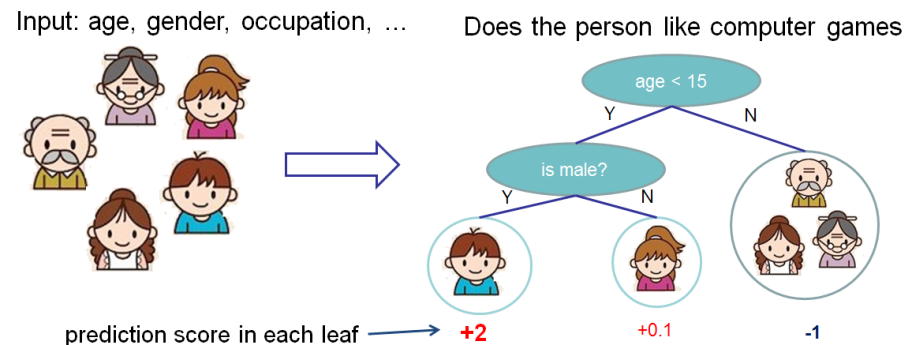

XGBoost
========================================================
author: Tong He 
date: July 11th, 2018
autosize: true

Outline
========================================================

- Introduction
- A tree-based model
- Training
- Interpretation
- Parameter-Tuning

Introduction
========================================================

Simply 


```r
install.packages('xgboost')
```

Load in


```r
library('xgboost')
```

eXtreme Gradient Boosting
========================================================

Base Model + Boosting

Tree-based Model
========================================================



Tree-based Model
========================================================

[Explanation in Animation](http://www.r2d3.us/visual-intro-to-machine-learning-part-1/)

Why Tree-based Model
========================================================

Advantages

- Interpretable
- Efficient
- Accurate

Boosting
========================================================

What to do with a weak model?

- Make it stronger!
- **Ask for help from the others**

Boosting
========================================================

Go beyond a single tree


Boosting
========================================================

Additive boosting

$$ r_1 = y - f_1(x) $$

Boosting
========================================================

Additive boosting

$$ r_2 = y - f_1(x) - f_2(x) = r_1 - f_2(x) $$

Boosting
========================================================

Additive boosting

$$ r_3 = y - f_1(x) - f_2(x) - f_3(x) = r_2 - f_3(x) $$

Boosting
========================================================

Additive boosting

$$\cdots$$

Boosting
========================================================

Iterative algorithm

- Iter 1
  - predict $y$ with $f_1(x)$
  - calculate $r_1 = y - f_1(x)$
- Iter 2
  - predict $r_1$ with $f_2(x)$
  - calculate $r_2 = r_1 - f_2(x)$
- ...
- $\sum_i f_i(x)$ is better than $f_1(x)$

Boosting
========================================================

One step further

- replace $r_1$ with $L(y, f_1(x))$
- ...
- replace $r_T$ with $L(y, \sum_t^T f_t(x))$

$$L(y, \sum_t^T f_t(x)) = L(y, \sum_t^{T-1} f_t(x) + f_T(x)) \approx L(y, \sum_t^{T-1} f_t(x)) + g(x)f_t(x)$$

Boosting
========================================================

Model

$$ pred = \sum_{t=1}^{T} \cdot f_t(x) $$

Objective

$$ Obj =  L(\sum_{t=1}^{T} f_t(x), y) $$


Why XGBoost
========================================================

- $L_1$ and $L_2$ regularization

$$ Obj = \sum_{t=1}^{T} L(f_t(x), y) + \Omega(f_t)$$

- Using both first and second order gradient

$$L(f_t(x), y) \approx g(x)f_t(x) + h(x)f^2_t(x)$$

- Prune on a full binary tree

Training
========================================================

[Human Resource Analytics](https://github.com/ryankarlos/Human-Resource-Analytics-Kaggle-Dataset)

- Moderate size
- Meaningful features
- Binary classification


```r
load('data/hr.rda')
dim(train_hr)
```

```
[1] 14999    10
```

Training
========================================================

Prepare data

- No need to normalize


```r
ind <- sample(nrow(train_hr))
train_ind <- ind[1:10000]
test_ind <- ind[10001:14999]

x <- train_hr[train_ind,-1]
# zero-based class label
y <- train_hr[train_ind,1]

x.test <- train_hr[test_ind,-1]
y.test <- train_hr[test_ind,1]
```

Training
========================================================

define parameters


```r
param <- list("objective" = "binary:logistic",
              "eval_metric" = "auc")
```

Training
========================================================

Cross Validation


```r
bst.cv <- xgb.cv(param = param, data = x, label = y, 
                 nfold = 3, nrounds = 10)
```

```
[1]	train-auc:0.977935+0.001538	test-auc:0.975974+0.003405 
[2]	train-auc:0.982490+0.001667	test-auc:0.978905+0.004239 
[3]	train-auc:0.984583+0.000465	test-auc:0.980356+0.004668 
[4]	train-auc:0.985948+0.001198	test-auc:0.981544+0.003764 
[5]	train-auc:0.986892+0.001435	test-auc:0.982412+0.003882 
[6]	train-auc:0.988337+0.001754	test-auc:0.982668+0.004176 
[7]	train-auc:0.989581+0.001473	test-auc:0.984227+0.003153 
[8]	train-auc:0.990055+0.001319	test-auc:0.984667+0.003182 
[9]	train-auc:0.990554+0.001196	test-auc:0.984849+0.003152 
[10]	train-auc:0.992073+0.000864	test-auc:0.985807+0.003400 
```

Training
========================================================

Cross Validation


```r
bst.cv
```

```
##### xgb.cv 3-folds
 iter train_auc_mean train_auc_std test_auc_mean test_auc_std
    1      0.9779347  0.0015378080     0.9759737  0.003404762
    2      0.9824897  0.0016670911     0.9789050  0.004239436
    3      0.9845830  0.0004645083     0.9803563  0.004667687
    4      0.9859477  0.0011981200     0.9815443  0.003764463
    5      0.9868923  0.0014353019     0.9824117  0.003881925
    6      0.9883367  0.0017540001     0.9826683  0.004175537
    7      0.9895810  0.0014727546     0.9842267  0.003152652
    8      0.9900553  0.0013194394     0.9846667  0.003182495
    9      0.9905537  0.0011957425     0.9848493  0.003151903
   10      0.9920730  0.0008641493     0.9858070  0.003400259
```

Training
========================================================

- Num of trees: `nrounds`, `eta`
- Depth of trees: `max_depth`, `min_child_weight`
- Randomness: `subsample`, `colsample_bytree`
- Penalty: `gamma`, `lambda`

Practice
========================================================

Play with parameters to see how the results change

Training
========================================================


```r
model <- xgboost(param = param, data = x, label = y, nrounds = 10)
```

```
[1]	train-auc:0.977574 
[2]	train-auc:0.979881 
[3]	train-auc:0.985361 
[4]	train-auc:0.985925 
[5]	train-auc:0.986335 
[6]	train-auc:0.987732 
[7]	train-auc:0.988687 
[8]	train-auc:0.989903 
[9]	train-auc:0.990156 
[10]	train-auc:0.990730 
```

Training
========================================================

predict


```r
pred <- predict(model, x.test)
length(pred)
```

```
[1] 4999
```

Practice
========================================================

Compare the evaluation on test set and cross validation.

Interpretation
========================================================

Feature importance


```r
importance <- xgb.importance(model = model)
importance
```

```
                Feature         Gain        Cover   Frequency
1:   satisfaction_level 0.5159322240 0.2736583812 0.205797101
2:   time_spend_company 0.1566868025 0.2026662588 0.118840580
3:      last_evaluation 0.1396977067 0.0851312600 0.168115942
4:       number_project 0.1156934810 0.2468011605 0.156521739
5: average_montly_hours 0.0677071966 0.1790257887 0.278260870
6:                sales 0.0030627491 0.0111438598 0.052173913
7:               salary 0.0009791323 0.0011303532 0.014492754
8:        Work_accident 0.0002407078 0.0004429377 0.005797101
```

Interpretation
========================================================

Feature importance


```r
xgb.plot.importance(importance)
```


Practice
========================================================

How parameters change the importance

Interpretation
========================================================

visualize a tree


```r
xgb.plot.tree(feature_names = colnames(x),
              model = model, trees = 0)
```

Interpretation
========================================================

Information from the tree

- Cover
  - Sum of second order gradient
- Gain
  - improvement from this split

Interpretation
========================================================

*There are too many trees!*


```r
xgb.plot.multi.trees(model)
```

Interpretation
========================================================

*Even a single tree is too large!*


```r
xgb.plot.deepness(model)
```


Practice
========================================================

How parameters change the depth

Parameter Tuning
========================================================

A new dataset:

- Moderate size
- Anonymous features
- Multi-classification


```r
load('data/otto.rda')
dim(train_otto)
```

```
[1] 61878    94
```

Parameter Tuning
========================================================


```r
x <- train_otto[, -1]
# zero-based class label
y <- train_otto[, 1] - 1

param <- list("objective" = "multi:softprob",
              "eval_metric" = "mlogloss",
              "num_class" = 9)
```

Parameter Tuning
========================================================


```r
bst.cv <- xgb.cv(param = param, data = x, label = y, 
                 nfold = 3, nrounds = 5)
```

Parameter Tuning
========================================================

What are tunable parameters?

Function doc:


```r
?xgb.train
```

Online doc:

- https://xgboost.readthedocs.io/en/latest

Parameter Tuning
========================================================

where to look at first

- Objective
- Metric
- eta/nrounds

Parameter Tuning
========================================================

Overfitting

- shallower trees: `max_depth`, `min_child_weight`
- stronger randomness: `subsample`, `colsample_bytree`
- stronger penalty: `gamma`, `lambda`
- domain knowledge: `monotone_constraints`
  
Parameter Tuning
========================================================

Underfitting

- deeper trees: `max_depth`, `min_child_weight`
- weaker randomness:  `subsample`, `colsample_bytree`
- weaker penalty: `gamma`, `lambda`
- parallel trees: `num_parallel_tree`

Practice
========================================================

Tune your parameters and hit mlogloss 0.4!

Parameter Tuning
========================================================

bias-variance trade off

Parameter Tuning
========================================================

cross validation

- The silver bullet?
  - Imbalanced class
  - Time-sensitive data

Parameter Tuning
========================================================

- trial-and-error
- grid search
- automatic tuning

Go even Faster
========================================================

Histogram


```r
params <- list(tree_method = 'hist')
```

Go even Faster
========================================================

Depth-wise  v.s. Loss-wise

- depth-wise

```r
params <- list(grow_policy = 'depthwise')
```
- loss-wise

```r
params <- list(grow_policy = 'lossguide')
```

Practice
========================================================

Tune your parameters and observe the efficiency

About
========================================================

- github: https://github.com/dmlc/xgboost
- forum: https://discuss.xgboost.ai
- doc: https://xgboost.readthedocs.io/en/latest

Q&A
========================================================

